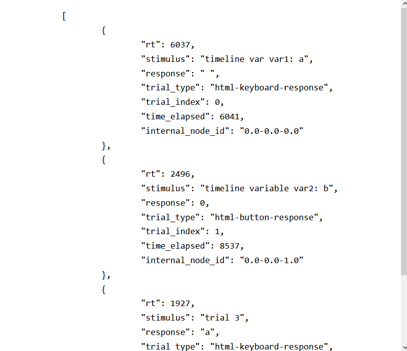
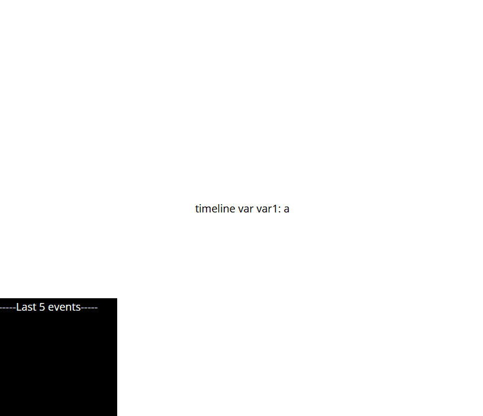

# jsPsych-replay

Additional functionality for [jsPsych](https://github.com/jspsych/jsPsych) that allows to record and replay user behaviour.

Record             |  Replay
:-----------------:|:-------------------------:
<pre>const jsPsych = initJsPsych({<br>log_data_for_replay: true,<br>data_for_replay_local_save: true<br>})</pre>`jsPsych.run(timeline)` <br><br> Make sure to save the `data_for_replay` file. | `jsPsych.replay('data_for_replay.txt')`
 | 

# 1. How to use

+ Use the current `dist` folder in your project. This folder contains the same files as the core `jsPsych` but with updated `jspsych.js` and `jspych.css` files.
+ Download and add the `cryo-0.0.6.js` file next to your `index.html` file in your project's directory - **SEE [1.1.](#11-critical-note-on-security-vulnerability) BELOW**
+ To record a user's behaviour, add these two parameters to your `jsPsych` initialisation:
```javascript
let jsPsych = initJsPsych({
	log_data_for_replay: true,
	data_for_replay_local_save: true
})
```
+ then, run your experiment as normal, using `jsPsych.run(timeline)`. At the end, the `jsPsych` instance will contain a property that contains the data for replay:
```javascript
jsPsych.data_for_replay
```
+ Either save the data locally by setting the `data_for_replay_local_save` to `true` as shown above, or at the end of the experiment, save the variable to a text file. For example:
```javascript
let jsPsych = initJsPsych({
	log_data_for_replay: true,
	data_for_replay_local_save: true,
	on_finish: function() {
		$.ajax({
			type: 'post',
			url: 'your-url.com',
			data: {
				filename: `data_for_replay_${user_id}.txt`,
				data_for_replay: jsPsych.data_for_replay
			}
		})
	}
})
```
+ Once you have the `data_for_replay.txt` file, re-run your exact same script, but this time use:
```javascript
jsPsych.replay('//path//to//your//data_for_replay.txt')
```

Voila!


## 1.1. CRITICAL NOTE ON SECURITY VULNERABILITY

This features relies on the [Cryo package](https://github.com/hunterloftis/cryo) for serialising and deserializing the data for replay. The package has been reported to contain critical security vulnerabilities. See [here](https://nvd.nist.gov/products/cpe/detail/F776F5A4-4E38-4BC7-B648-E778B90666DE?namingFormat=2.3&orderBy=CPEURI&keyword=cpe%3A2.3%3Ao%3Acryo_project%3Acryo%3A0.0.6%3A*%3A*%3A*%3A*%3Anode.js%3A*%3A*&status=FINAL%2CDEPRECATED) and [here](https://hackerone.com/reports/350418). This vulnerability is quite dangerous as I think an extremely tech-savvy participant might insert some malicious code into the client-side-available variables that are written into the `data_for_replay` object; then, when the `data_for_replay` object is deserialized by the experimenter, the malicious code might be executed.

Note that this, although possible, requires decent amount of technical sophistication. There are solutions to this but they are quite arduous. If you are interested, look up for ways to safely deserialize a JSON object in and ways to blacklist `__prototype__` properties of an object for a custom solution.

## 1.2. Notes on usage

+ Only records the following events: `['keydown', 'keyup', 'click', 'mousedown', 'mouseup', 'mousemove']`, equivalent to a key press, mouse click and mouse move.
+ The last event that triggers the experiment to end is never replayed - don't know why, but should be easily fixable.
+ Screen size should be borderline irrelevant, as the click locations are calculated relative to viewport.
+ Only access the `jsPsych.data_for_replay` at the end of the experiment in the `on_finish` function to get the contents that need to be written to a text file - before that they are represented as unserialized objects.
+ Timing may vary - expect around 30-50ms (not tested) at least. For extraordinarily time-sensitive experiment (e.g. a masking paradigm), thread cautiously.
+ Not all plugins are tested - quite likely that there will be problems with other plguins, as well as custom behaviours. Let me know if you spot anything.

# 3. Development

Obviously this is just a quickly put-together version, not meant to be integrated in the core `jsPsych` as is, but it should contain the core logic needed to create the replay functionality. A lot of chunks of code are terrrible, but the central logic should, more or less, be there.

## 3.1. Core logic

+ Serialize the current user's `timeline`. This is saved in the `jsPsych.data_for_replay`. Initially the `jsPsych.data_for_replay` object looks like this: `this.data_for_replay = {'timeline': [], 'all_replay_events': []}`, containing a list of objects, but then the `jsPsych.data_for_replay` gets JSON/Cryo serialized in order to be saved to a text file.
+ Similar process happens for `all_replay_events` object, which is a list of event objects. These are serialized a bit more carefully - see the `serializeEvent` function - though the current approach is a rather crude one. This also gets serialized only at the very end.
+ Funnily - as I could not think of a different approach that works locally - the contents of the text file instantiate two variables: `timeline_for_replay` and `all_replay_events`, which then get processed for replay. Reading in the file happens by dynamically inserting a script into the `index.html` and waiting for it to load. Although this is rather ridiculous, at least it has the benefit of re-running all other experiment settings as is.
+ Customizing the replay behaviour: I was inspired by [Josh de Leeuw's mouse tracking extension](https://www.jspsych.org/7.3/extensions/mouse-tracking/#examples) for the display of mouse move, and all those can be customized - see the `start_replay()` function. I envision incorporating neater animations, blur/focus event captures (blurring the screen), screen resising display and more!

## 3.2. Notes

+ A more sophisticated approach to timing is warranted: e.g. calculating events timing relative to the current trial's start time; this would account for any network/hardware differences between record/replay
+ Screen sizes should be good (see [1.2.](#12-notes-on-usage) above) though, not tested extensively.
+ Not all plugins are tested - quite likely that there will be problems with other plguins, as well as custom behaviours. I envision problems with survey and scale plugins, video/audio responses (obviously) as well as surveys that have scrolling! All of these should be resolve-able.
+ There are differences in behaviour when parsing DOM from string between browsers, e.g. see [here](https://stackoverflow.com/a/46487392/13078832).